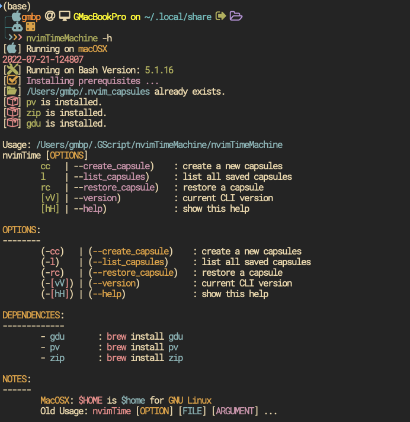
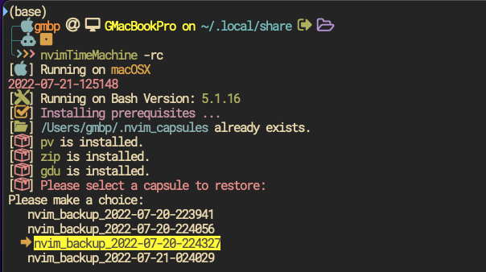

# Nvim Time Machine

## Introduction
You can run the command line `nvimTimeMachine` to create, list and restore your nvim environment. It can
roll-back to the date you created your nvim backup. There are so many other
options available created by many great developers, but I wanted something easy
to be used and getting me full control. Instead of reading all error messages
generated when we update or upgrade the `nvim` environment and roll-back
defected plugins one by one, this `CLI` was created.





## Requirements

Currently this script support working on Mac mainly, in both `Intel` and `Arm64`-based systems.
dependencies=(
- `pv`
- `zip`
- `gdu` for `GNU Linux` you can use `du` instead of `gd`
Please check the --help for more details.

## How to use
```bash
#Usage:
nvimTime [OPTIONS]
	cc   | --create_capsule    : create a new capsules
	l    | --list_capsules     : list all saved capsules
	rc   | --restore_capsule   : restore a capsule
	[vV] | --version           : current CLI version
	[hH] | --help              : show this help

```
### To create a time machine capsule
```bash
nvimTimeMachine -cc
# or --create_capsule
nvimTimeMachine --create_capsule
```
### To list all current time machine capsules
```bash
nvimTimeMachine -l
# or
nvimTimeMachine --list_capsules
```
### To restore specific capsules
```bash
nvimTimeMachine -rc
# or
nvimTimeMachine --restore_capsule
```
## Installation Instructions
```bash
mkdir ~/.GScript/.nvimTimeMachine # You can search the path and adjust in the script.
cd ~/.GScript/
git clone git@github.com:Ghasak/nvimTimeMachine.git ~/.GScript/
chmod -x ~/.GScript/nvimTimeMachine/nvimTimeMachine
ln -s ~/.GScript/nvimTimeMachine/nvimTimeMachine /usr/bin/
# Or
# In your .profile, or .zshrc or .bashrc whatever is your running shell, put
source PATH="$PATH:$HOME/.GScript/nvimTimeMachine/nvimTimeMachine"
```


